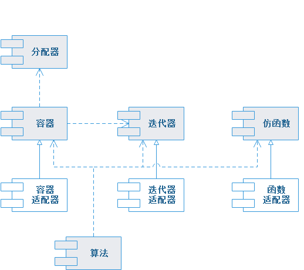

# STL简介

STL 是“Standard Template Library”(标准模板库)的缩写，是C++标准库的一部分，无需安装。

STL标准模板库中包含六大组件：

| 组件类型 | 组件描述                                                     |
| :------: | :----------------------------------------------------------- |
|   容器   | 针对不同应用场景，提供不同**数据结构**来存储管理同一种类型对象的集合。 |
|  迭代器  | 一种无需暴露容器数据结构，且能顺序访问容器中所有元素的抽象设计(迭代器设计模式)。 |
|   算法   | 对容器各式各样的操作方法，包括但不限于：排序、全排列、查找等。 |
|  适配器  | 使用适配器设计模式，将基本组件的接口转换成新接口，使其具备其他功能。 |
|  仿函数  | 类中重载函数调用操作符operator()，使其行为表现类似一个函数。 |
|  分配器  | 为容器提供动态内存的管理。                                   |

六大组件之间的关系：

* 容器通过分配器取得数据存储空间；

* 算法通过迭代器向容器存取数据；

* 算法通过仿函数完成不同的策略；

* 适配器基于容器、迭代器和仿函数分别实现容器适配器、迭代器适配器和函数适配器。

