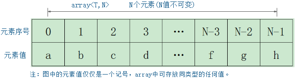

# array简介

array是C++11新引入的一种C-Style的静态数组容器，array类型的变量一旦定义，其存储的成员类型和成员个数就固定下来，不可增删元素。



**存储结构说明：**

* array对象及成员均在**栈**中；

* array对象中的成员个数不可改变；

* array成员之间**连续**存储，支持**随机**访问；

**类声明：**

```c++
template< 
    class T, 
    std::size_t N 
> struct array;

// 头文件包含
#include <array>
```

**容器相关操作：**

* 增：不支持

* 删：不支持

* 查：

  * 可通过脚标序号访问元素

  * 支持随机访问(角标序号之间可做运算后访问array成员)

  * 逐个元素比较进行查找，时间复杂度为$O(n)$

* 改：array中元素可修改
