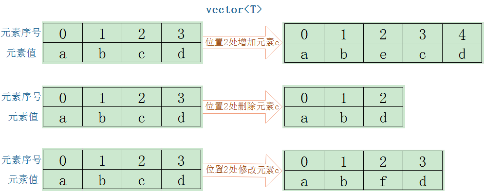

# vector简介



**存储结构说明：**
vector是一个可用于存放T类型，随着元素的个数变化而改变存储空间大小的可变序列容器。

* vector对象可在栈中，也可在堆中；

* vector的成员存储在堆中；

* vector的成员个数可变化；
  
* vector的成员之间连续存储，可支持随机访问。

**类声明：**

```c++
template<
    class T,
    class Allocator = std::allocator<T>
> class vector;

// 头文件包含
#include <vector>
```

**容器相关操作：**

* 增：vector容器中增加新元素，涉及内存数据搬移

   * 预分配空间不足，申请内存，搬移成员数据到新空间，时间复杂度$O(n)$；

   * 预分配空间充足
      * 尾部插入，时间复杂度$O(1)$
      * 非尾部插入，需要将插入点及以后元素后移，时间复杂度为$O(n)$

* 删：vector容器中删除某元素，涉及内存数据搬移
   * 删除尾部元素，时间复杂度为$O(1)$
   * 删除非尾部元素，时间复杂度为$O(n)$

* 查：
   * 可通过角标和迭代器访问元素；
   * 支持随机访问；
   * 逐个元素比较查找，时间复杂度为$O(n)$

* 改：
   * 角标方式修改
   * 迭代器方式修改

**应用场景：**

* 元素个数不确定，尾部追加元素；
* 元素个数确定，通过角标快速访问；
* 容器中间增删次数较少。
