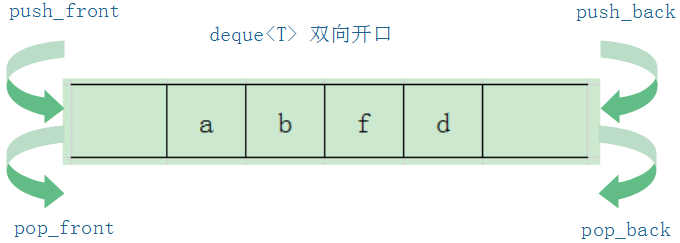
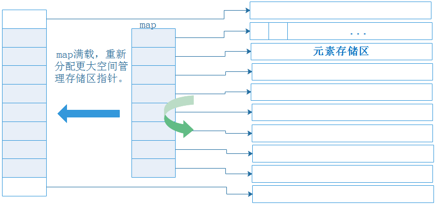

# deque简介



deque是一个可存放T类型的，存储空间可变的蓄力容器。

* deque同样是一种连续性存储容器；

* deque是一种**首尾均能高效**插入和删除元素的双向开口容器；

* deque对象可在栈中，也可在堆中；

* deque的元素存储在堆中；

* deque的元素个数可变，且元素可重复。



**存储结构说明：**

deque虽然对外呈现是一个连续性存储空间，但deque内部真实存储结构是由一小块连续空间组成的map(注：不是STL中的map容器)，和多个定量连续存储区(存储元素的空间)构成。

* map存储的是指向各个定量连续存储区的指针；
* 元素存储区中，存储的是用户保存进来的元素；
* map已经被占满，需要在首尾插入新元素时：
  * 重新map的存储空间；
  * 将原map中的存储区指针拷贝到新的map存储空间；
  * 分配相应的元素存储区，并将其首地址保存到map中；
  * 将新元素添加到新分配的元素存储区

deque存储空间不足时，只需要新增分配的存储空间，无需将原有的元素拷贝到新存储空间。

**vector 与 deque对比**


**类声明：**

```c++
template<
    class T,
    class Allocator = std::allocator<T>
> class vector;

// 头文件包含
#include <vector>
```

**容器相关操作：**

* 增：vector容器中增加新元素，涉及内存数据搬移

   * 预分配空间不足，申请内存，搬移元素数据到新空间，时间复杂度$O(n)$；

   * 预分配空间充足
      * 尾部插入，时间复杂度$O(1)$
      * 非尾部插入，需要将插入点及以后元素后移，时间复杂度为$O(n)$

* 删：vector容器中删除某元素，涉及内存数据搬移
   * 删除尾部元素，时间复杂度为$O(1)$
   * 删除非尾部元素，时间复杂度为$O(n)$

* 查：
   * 可通过角标和迭代器访问元素；
   * 支持随机访问；
   * 逐个元素比较查找，时间复杂度为$O(n)$

* 改：
   * 角标方式修改
   * 迭代器方式修改

**应用场景：**

* 元素个数不确定，尾部追加元素；
* 元素个数确定，通过角标快速访问；
* 容器中间增删次数较少。
