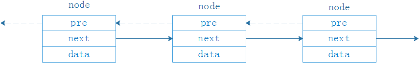

# list简介



**存储结构说明：**
list是一个可用于存放T类型元素的双向链表，可在容器任意位置随意插入和删除元素。

* list对象可在栈中，也可在堆中；

* list的元素存储在堆中；

* list的元素个数可变化，元素可重复。

**类声明：**

```c++
template<
    class T,
    class Allocator = std::allocator<T>
> class list;

// 头文件包含
#include <list>
```

**容器相关操作：**

* 增：list容器中增加新元素，只需要修改前后节点中指针的指向，时间复杂度为$O(1)$

* 删：list容器中删除某元素，也只需要修改前后节点中指针的指向，时间复杂度为$O(1)$

* 查：

  * 使用迭代器，逐个元素比较查找，时间复杂度为$O(n)$

* 改：

  * 迭代器方式修改

**应用场景：**

* 常用于在容器**任意**位置**频繁**增删的场景
