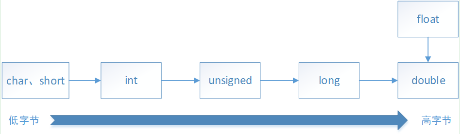

# 隐式转换

## 问题

观察下面的3段代码，他们的输出结果是否有差异？为什么？

代码1

```c++
#include <iostream>
using namespace std;

int main()
{
    char count = 255;
    for (int i = 0; i < count; ++i) {
        cout << "i = " << i << endl;
    }

    return 0;
}
```

代码2

```c++
#include <iostream>
using namespace std;

int main()
{
    char count = 255;
    for (unsigned int i = 0; i < count; ++i) {
        cout << "i = " << i << endl;
    }

    return 0;
}
```

代码3

```c++
#include <iostream>
using namespace std;

int main()
{
    short count = 256;
    for (unsigned char i = 0; i < count; ++i) {
        cout << "i = " << i << endl;
    }

    return 0;
}
```

## 答案

* 代码1，无输出
* 代码2，一直打印i的值，从0至4294967295
* 代码3，一直打印i的值表示的字符，无限循环

## 原因分析

**代码1分析**

* char类型的数据能表示的范围为[INT8_MIN, INT8_MAX],即[-128, 127]，不能表示255。255赋值给char类型的变量后，将作为反码解析成char类型的-1。
* char与int比较运算，将char隐式转换为int再进行比较，但值同样为-1。
* 变量i的初始值是从0开始的，因此不能满足for的循环条件，自然不能打印出任何东西。

**代码2分析**

* 同代码1，count所在地址存储的是-1的反码。
* char与unsigned int比较运算，将char隐式转换为unsigned int再比较，此时值为UINT32_MAX(4294967295)。
* 变量i的初始值从0开始，因此将循环4294967295次后，停止。

**代码3分析**

* short类型的数据，能表示的范围为[INT16_MIN, INT16_MAX]，即[-32768, 32767]，足以表示256。
* unsigned char与short比较运算，都转换为unsigned int运算。
* unsigned char类型的变量i的值，累加后一直不能超过256，因为i到255后，下一个数就出现翻转，i的值变为0.


## 隐式转换规则

触发条件：不同数据类型间进行操作



转换规则是**由低字节向高字节**转换。


## 建议

* 涉及多个数之间的运算时，一定采用同类型的数据进行运算，防止隐式转换导致不可预期结果。
* 定义局部变量，或函数入参时，建议都使用能表示较大范围的数据类型，比如int，unsigned int等。此种做法常常还避免内存字节对齐问题，提高运行效率。(ps：内存受限的系统中，定义存储上下文信息的变量时，采用较小范围的数据类型。)

