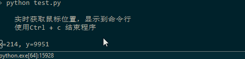

# 实时获取鼠标位置

使用开源库[pyautogui](https://pyautogui.readthedocs.io/en/latest/)获取Windows鼠标的当前位置信息。

```python
# coding=utf-8

import time
import pyautogui

def get_cursor_pos():
    '''
    实时获取鼠标位置，显示到命令行
    使用Ctrl + c 结束程序
    '''
    try:
        while True:
            cursor_pos = pyautogui.position()
            pos_info = f"x={cursor_pos.x}, y={cursor_pos.y}"
            show_str_in_same_line(pos_info)
            time.sleep(0.1)

    except KeyboardInterrupt:
        pass

def show_str_in_same_line(info):
    '''
    多次调用，都将显示在同一行，且覆盖上一次显示的内容
    '''
    print(info, end="")
    print("\b"*len(info), end="", flush=True)


def main():
    print(get_cursor_pos.__doc__)
    get_cursor_pos()

if __name__ == "__main__":
    main()
```

运行效果：


