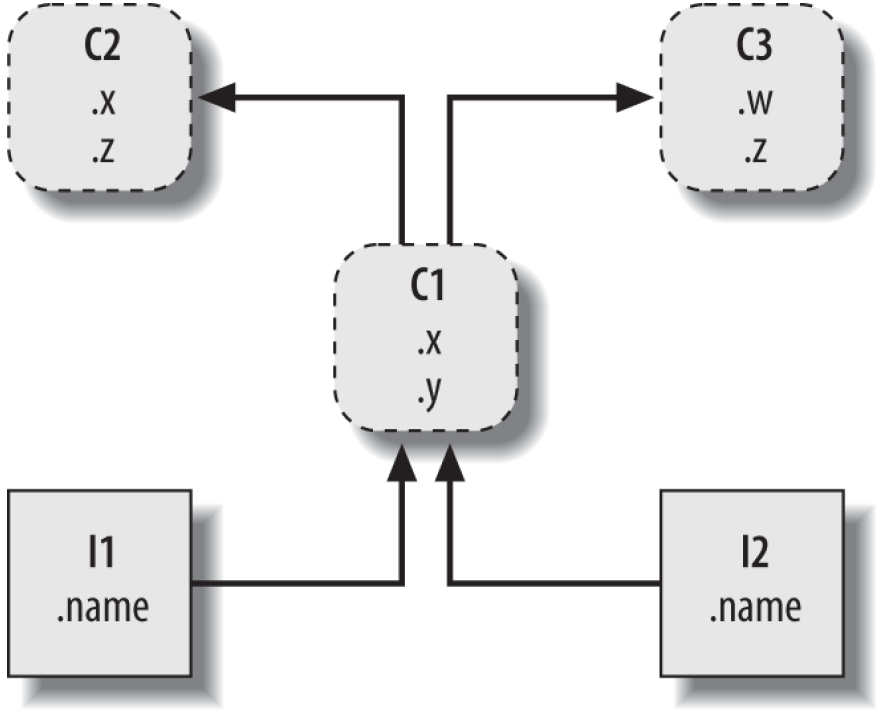

# 类的继承属性搜索规则

**基于LEGB搜索规则，并根据类的继承关系树，自底向上，自左向右搜索，直到找到第一个属性为止。（如果未找到，抛出异常）**



<p style="font-size: smaller; font-style: italic; text-align: center;">图片来自：《Learning Python 5th Edition》一书Figure 26-1</p>

例如：C1继承C2和C3两个类，那么C1类的对象I1对某个属性的访问，搜索路径

```python
I1.name : I1;
I1.x    : I1->C1;
I1.y    : I1->C1;
I1.z    : I1->C1->C2;
I1.w    : I1->C1->C2->C3;
```

从Python的搜索路径来看：

* 子类定义了与父类相同的属性，按照LEGB的搜索规则+自底向上进行搜索；
* 存在多继承且各父类中存在相同的属性(图中的C2和C3的z)时，按照LEGB搜索规则 + 自底向上 + 多继承从左至右搜索。

**FAQ:**

* 如何定义“左”与“右”？
    > 根据子类多继承列表中的顺序保持一致即为从左至右的顺序，例如：`class C1(C2, C3)`，括号列表中的顺序，C2即为左，C3即为右。
* 如何确定其搜索路径？
    > Python中提供了`__mro__`属性，即method resolution order, MRO方法搜索路径，使用方法：`C1.__mro__`


## 类属性单继承

```python
class C2(object):
    x = 1
    z = 90
class C1(C2):
    z = 2
    w = 68

if __name__ == "__main__":
    c = C1()
    print(c.x)
    print(c.z)
    print(c.w)
```

代码输出：

```python
1
2
68
```

* 类属性，可直接被子类继承。
* 子类存在与父类同名属性，子类覆盖父类。

## 类对象属性单继承

### 子类无构造函数

```python
class C2(object):
    def __init__(self):
        self.x = 1
        self.z = 90
class C1(C2):
    z = 2    
    w = 68

if __name__ == "__main__":
    c = C1()
    print(c.x)
    print(c.z)  
    print(c.w)
```

代码输出：
```
1
90
68
```

**分析**

* 子类C1无构造函数`__init__`，创建对象时，默认调用父类的构造函数，定义类对象属性。
* 子类C1中同名类属性，`self.z`属于Local变量，而`C1.z`类属性属于Enclosing function locals闭包局部作用域内的变量。按照LEGB搜索规则，`c.z`访问的是父类C2中的类对象变量`self.z`。 

**小结**

* 子类无构造函数，将默认调用父类的构造函数
* 子类类属性与父类类对象属性同名，按照Python的LEGB搜索规则确定相应的符号。

### 子类有构造函数

```python
class C2(object):
    def __init__(self):
        self.x = 1
        self.z = 90
class C1(C2):
    def __init__(self):
        self.z = 2
        self.w = 68

if __name__ == "__main__":
    c = C1()
    print(c.x)
    print(c.z)
    print(c.w)
```

代码输出：

```python
   print(c.x)
AttributeError: 'C1' object has no attribute 'x'
```

**分析**

* 子类定义与父类的同名函数，覆盖父类函数；
* 子类定义了构造函数，创建子类对象，仅默认调用子类构造函数。

**解决方案**

在子类中显示调用父类构造函数

```python
class C2(object):
    def __init__(self):
        self.x = 1
        self.z = 90
class C1(C2):
    def __init__(self):
        super().__init__()  # 或采用： C2.__init__(self)
        self.z = 2
        self.w = 68

if __name__ == "__main__":
    c = C1()
    print(c.x)
    print(c.z)
    print(c.w)
```

代码输出：

```python
1
2
68
```

## 类属性多继承

```python
class C2(object):
    x = 1
    z = 90
class C3(object):
    z = 25
    w = 15
    y = 28
class C1(C2, C3):
    z = 2
    w = 68

if __name__ == "__main__":
    c = C1()
    print(c.x)
    print(c.y)
    print(c.z)
    print(c.w)
```

代码输出：

```python
1
28
2
68
```

如前所述，按照LEGB，自底向上，从左至右搜索属性。

## 类对象属性多继承

### 子类无构造函数

多继承中，子类无构造函数，创建子类对象时，仅调用多继承的第一个父类的构造函数。

```python
class C2(object):
    def __init__(self):
        self.x = 1
        self.z = 90
class C3(object):
    def __init__(self):
        self.z = 25
        self.w = 15
class C1(C2, C3):
    z = 2
    w = 68

if __name__ == "__main__":
    c = C1()
    print(c.x)
    print(c.z)
    print(c.w)
```

代码输出：

```python
1
90
68
```

### 子类有构造函数

子类有构造函数，需要显示调用父类构造函数。

```python
class C2(object):
    def __init__(self):
        self.x = 1
        self.z = 90
class C3(object):
    def __init__(self):
        self.z = 25
        self.w = 15
        self.y = 28
class C1(C2, C3):
    def __init__(self):
        C2.__init__(self)
        C3.__init__(self)
        self.z = 2
        self.w = 68

if __name__ == "__main__":
    c = C1()
    print(c.x)
    print(c.y)
    print(c.z)
    print(c.w)
```

代码输出：

```python
1
28
2
68
```
